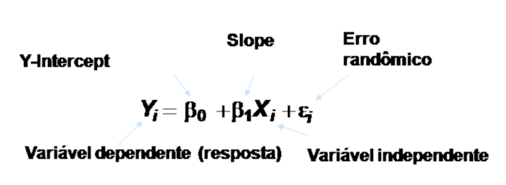
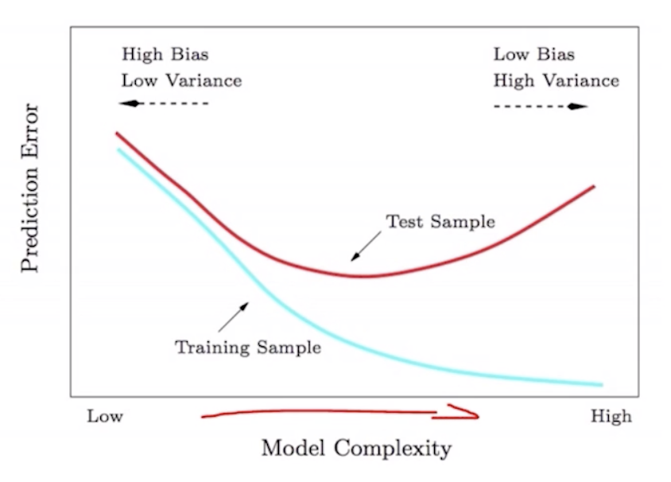
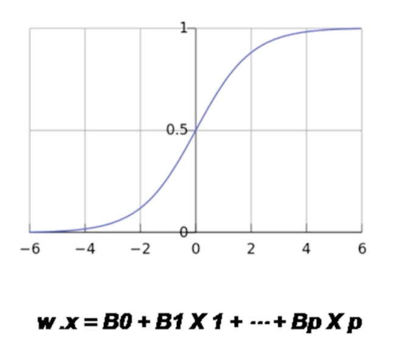
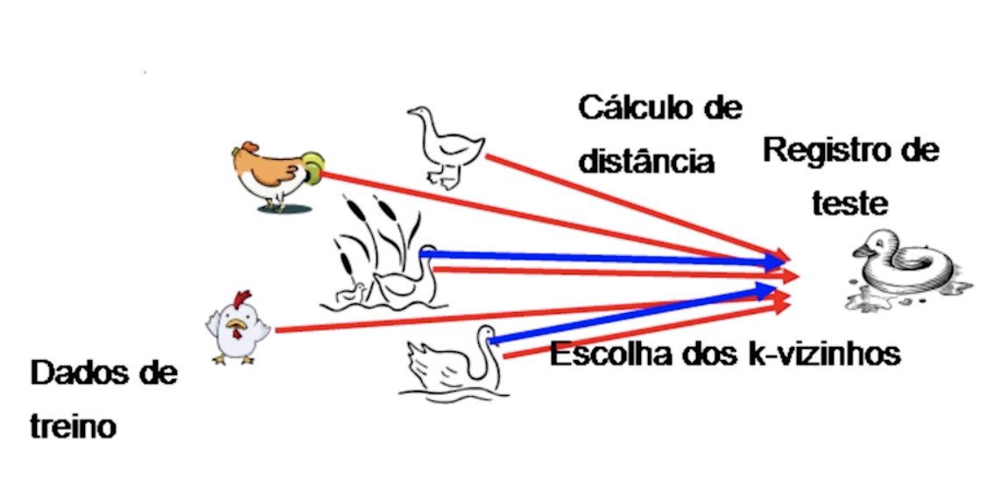
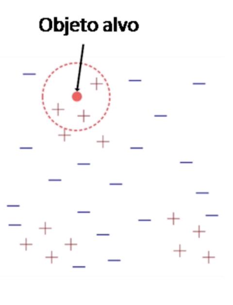
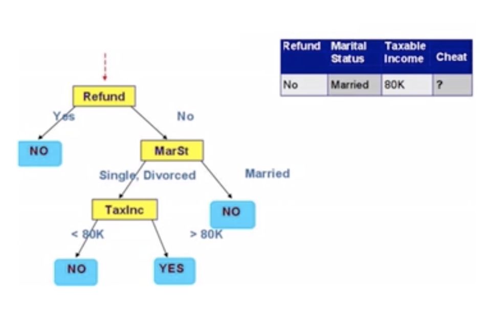
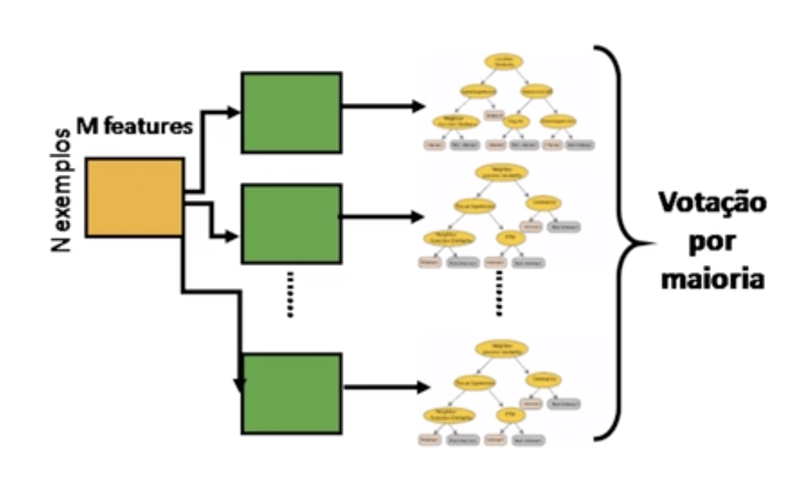
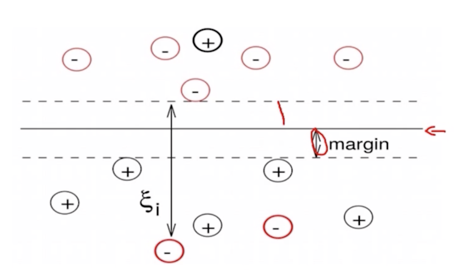
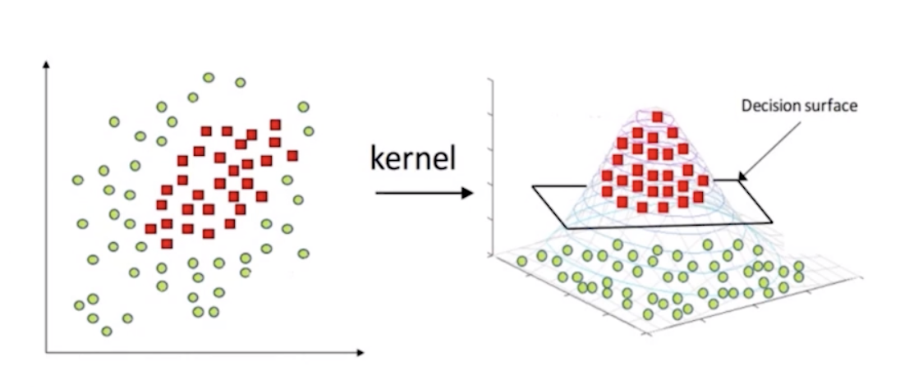

# Aprendizado de Modelos Preditivos

## Aula 4.1.1 - Regressão linear

- Regressão Linear é processo estatístico que visa estimar a relação
   entre variáveis.
- A regressão linear nos ajuda a entender como o valor da variável dependente se altera, quando uma das variáveis independentes se altera.
- O objetivo é encontrar uma função de variáveis independentes chamada de função de regressão.

### Sistemas lineares

Um sistema linear é uma coleção de duas ou mais equações lineares, envolvendo o mesmo conjunto de variáveis.

### Resolvendo regressão linear

Precisamos responder duas questões:

- como determinar os coeficientes de regressão? (problema dos quadrados mínimos)

- com determinar o número de variáveis independentes a se considerar na função final? (seleção de modelos)

### Viés x Variância

## Aula 4.2 - Regressão logística (logit)

- Método recomendado para situações em que a variável dependente é de natureza dicotômica ou binária.
- Os resultados da analise ficam contidos no intervalo de 0 a 1.
- funciona para conjuntos de dados relativamente grandes.

### Regressão linear vs Regressão logistica

## Aula 4.3 - KNN & CART

### KNN

- Aprendizado supervisionado
- Os dados são representados em um espaço vetorial e os vizinhos são definidos em termeos de distância.
- No cálculo do vizinho mais próximo, a função alvo pode retornar valores discretos ou reais.

#### Princípio: me diga com quem andas que te direi quem és.
Se anda com oum pato, grasna como um pato, então é um pato.

#### Escolha do K

- O valor de K é determinado experimentalmente.
- Heuristica de seleção do K ótimo.
  - Comece com K = 3 e teste para validar a taxa de erro.
  - Repita com K = K + 2
  - Escolha o K para o qual a taxa de erro é mínima.
- Tente sempre utilizar um K impar, para evitar empates.

### CART - Árvores de classificação e regressão (Classification and Regression Trees)

As Árvores de classificação e regressão (CART) são **arvores binárias** não paramétricas, que produzem árvores de classificação ou regressão dependendo se a variável dependente é categórica ou numérica, respectivamente.

#### Regra de separação:
- Árvores de regressão: possui uma função objetiva continua e a medida de separação usada é a soma dos erros quadrados (SSE).
- Árvores de classificação: possui uma função objetiva categórica, e as principais medidas de separação são: Gini measure e Entropia, dentre outras que visam estimar a pureza de cada nodo da árvore.

## Aula 4.4 - Árvores de decisão & Ensemble Trees

### Árvores de decisão
- Usa uma estrutura hierárquica para representar visualmente decisões.
- **Árvores n-árias**
- Dois tipos: árvores de classificação e regressão

### Randon Forest
- Um dos classificadores mais populares para dados densos.
- Fácil de implementar.
- Facilmente paralelizável.
- Precisa de muitas iterações sobre os dados.

### Boosted Decision Trees

## Aula 4.5 - SVM (Máquinas de vetor suporte)
- Amplamente utilizado para classificação de documentos, manuscritos, imagens, dentre outros.
- Capaz de produzir apenas modelos lineares.
- Encontram o separador linear ótimo.
- Aquele que tem a maior margem entre eles e os exemplos positivos de um lado e os negativos de outro

### Problemas não lineares

